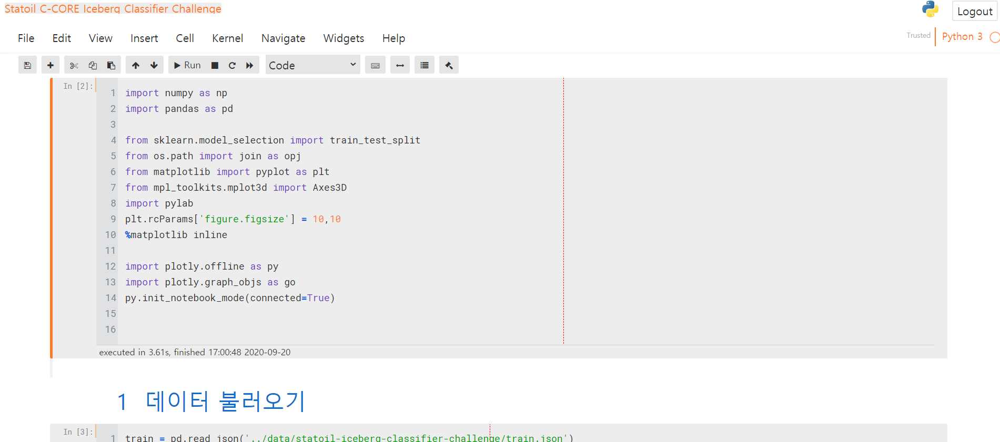

```
jt -t onedork -T -N -kl -f roboto -fs 12 -tfs 11 -nfs 14 -tfs 14 -ofs 10 -cellw 90% -lineh 170 -cursc r -cursw 6
jt -t grade3 -T -N -kl -f roboto -fs 12 -tfs 11 -nfs 14 -tfs 14 -ofs 10 -cellw 90% -lineh 170 -cursc r -cursw 6
```

```
jt -t grade3 -fs 95 -altp -tfs 11 -nfs 115 -cellw 88% -T
```




