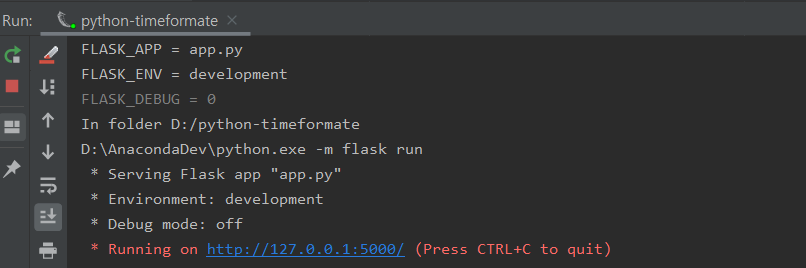
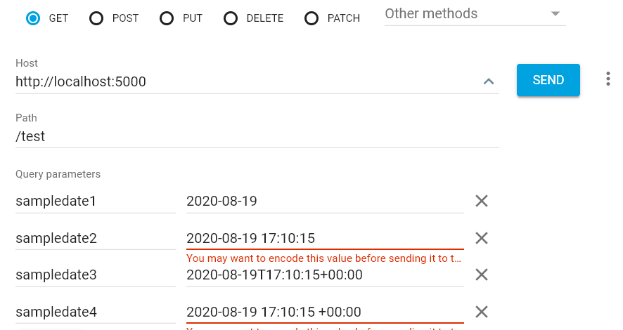
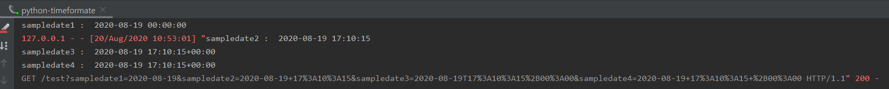

flask를 통해 restful을 구현하고, datetime을 파라미터로 전송하는 법에 대해서 알아보자.


아래는 flask를 구현한 코드이다. 


```python
from flask import Flask
from flask_restful import  reqparse, abort, Api, Resource
import datetime

app = Flask('TimeFormate Test')
api = Api(app)

class TimeFormatTest(Resource):
    def get(self):

        parser = reqparse.RequestParser()
        parser.add_argument('sampledate1', type=lambda s: datetime.datetime.strptime(s, '%Y-%m-%d'))
        parser.add_argument('sampledate2', type=lambda s: datetime.datetime.strptime(s, '%Y-%m-%d %H:%M:%S'))
        parser.add_argument('sampledate3', type=lambda s: datetime.datetime.strptime(s, '%Y-%m-%dT%H:%M:%S%z'))

        args = parser.parse_args()

        print('sampledate1 : ', args['sampledate1'])
        print('sampledate2 : ', args['sampledate2'])
        print('sampledate3 : ', args['sampledate3'])


api.add_resource(TimeFormatTest, '/test')


if __name__ == '__main__':
    app.run()
```


> 참고 :  Python timeformat
>
> | TimeFormat           | sample time                |
> | -------------------- | :------------------------- |
> | %Y-%m-%d             | 2020-08-19                 |
> | %Y-%m-%d %H:%M:%S    | 2020-08-19 17:10:15        |
> | %Y-%m-%dT%H:%M:%S%z  | 2020-08-19T17:10:15+00:00  |
> | %Y-%m-%d %H:%M:%S %z | 2020-08-19 17:10:15 +00:00 |
>


위의 코드를 실행하면, 아래와 같이 flask를 통한 webserver가 실행된다. 




test를 위해 아래의 RestURL 호출한다.

google에서 지원하는 [AdvancedRestClient](<https://chrome.google.com/webstore/detail/advanced-rest-client/hgmloofddffdnphfgcellkdfbfbjeloo>)를 통해서 url을 생성하였다. 




생성한 URL을 Encoder하여 GET으로 호출한다.

```http
GET http://localhost:5000/test?sampledate1=2020-08-19&sampledate2=2020-08-19+17%3A10%3A15&sampledate3=2020-08-19T17%3A10%3A15%2B00%3A00&sampledate4=2020-08-19+17%3A10%3A15+%2B00%3A00
```


호출 결과, 4가지 형식에 맞게 timeformat이 적용된 것을 확인할 수 있다. 




> 참고사이트 
>
> [python-datetime-document](<https://docs.python.org/3/library/datetime.html#datetime.datetime.fromisoformat>)
>
> [flask-http-basic-application-document](<https://flask-docs-kr.readthedocs.io/ko/latest/quickstart.html>)