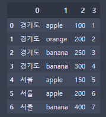
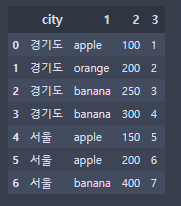
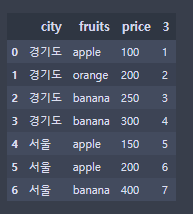

```python
df1 = pd.DataFrame([['부산', '부산', '부산', '부산', '서울', '서울', '서울'],
    ['apple', 'orange', 'banana', 'banana', 'apple', 'apple', 'banana'],
    [100, 200, 250, 300, 150, 200, 400],
    [1, 2, 3, 4, 5, 6, 7]])
df1 = df1.T
df1
```



```python
# 특정 컬럼 하나만 수정
df1.rename(columns={0:'city'}, inplace=True)
df1
```



```python
# 복수개의 컬럼 이름 설정 
df1.rename(columns={1:'fruits', 2:'price'}, inplace=True)
df1
```




> 참고 사이트 
>
> [pandas-docs](<https://pandas.pydata.org/pandas-docs/stable/reference/offset_frequency.html>)
>
> [Python Pandas 데이터 분석](<https://ponyozzang.tistory.com/291>)